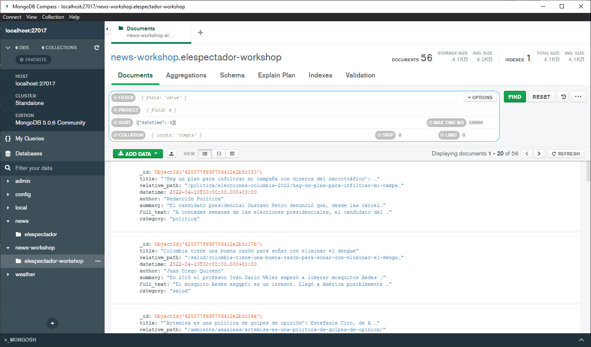
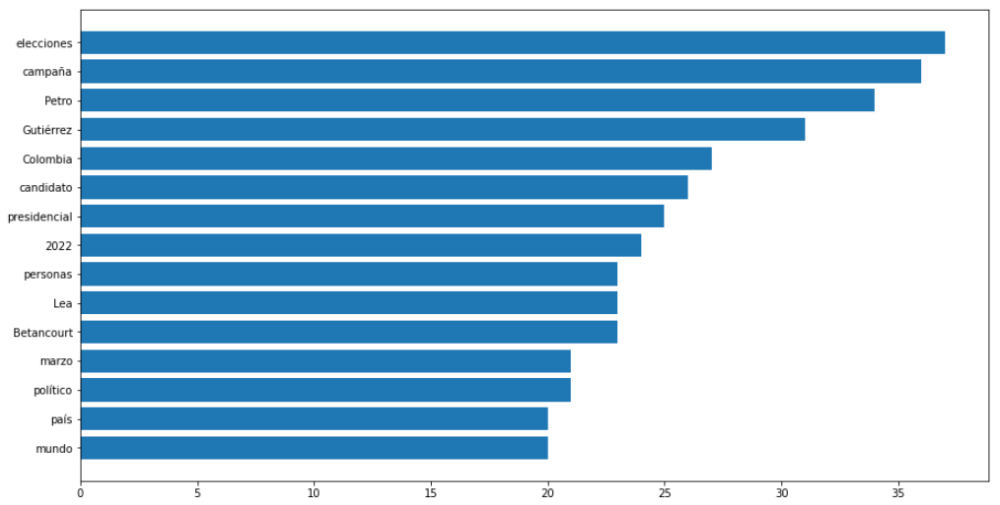
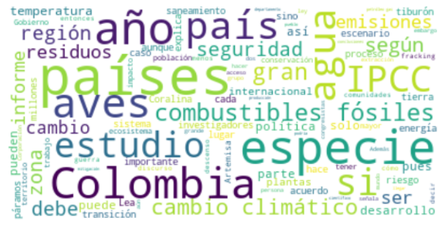

# Web-Scrapping (Test 2)

## Members:
- Garnica Ortiz Diego Fernando
- León Vargas Boris Nicolas
- Losada Ordoñez Mateo Alejandro

## High-level functionality

- This code uses an algorith with PySpark implementing web-scrapping in the website of "Alianza verde" to get the content of the senate candidate's cards 

- We made a fork of the repo to start the process and made some changes to the NLP workshop's code, implementing functions seen in the last sessions.

- First there is the process of web scrapping in which we made the same process of searching information about the candidates for the senate, like image URL, the description and the social networks.

- After that, all the data were stored in an array called 'candidates'

- Also you can see some of the evidences of the candidate information collected in the directoy of 'evidences' like this:

## News saved on the MongoDB Database

## Bargraph of the politics catagory

## Wordcloud of the environment catagory

- On the other hand, there are some evidences that can be seen inside the project, so please run the project with the following steps:

#### Instructions

+ Clone this repository
+ If you use MACOS please in the 8th command block erase the '.exe' from the line "DRIVER_PATH = './geckodriver.exe' "
+ Open a command line console and go inside the repo's directory and run the command "jupyter lab"
+ Run each code block to the end.D
